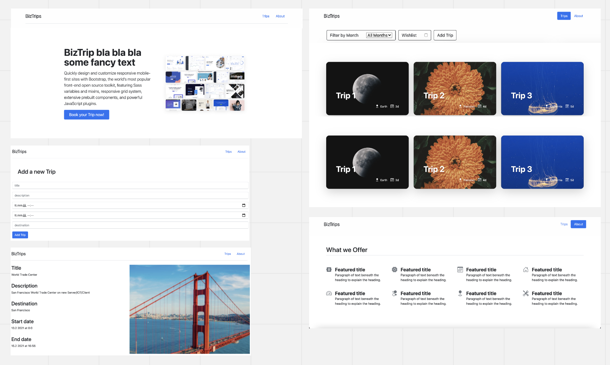

# Modul_120_biztrips
=======
## Quick Start

Run the following commands:

```
npm install
npm start
```

This will install dependencies, then start the app and mock API.

## Starter Project Overview

This project was bootstrapped with [Create React App](https://github.com/facebook/create-react-app).

I made the following enhancements:

1. Added a mock API using [json-server](https://github.com/typicode/json-server). Configured `npm start` to run the app and mock API at the same time using [npm-run-all](https://www.npmjs.com/package/npm-run-all). See [Building Applications with React and Flux](https://app.pluralsight.com/library/courses/react-flux-building-applications/table-of-contents) for details on how to set this up from scratch.
1. Installed [react-router-dom](https://www.npmjs.com/package/react-router-dom), [history](https://www.npmjs.com/package/history) (React Router peer dependency), and [cross-env](https://www.npmjs.com/search?q=cross-env) for declaring environment variables.
1. Added some React components to help us get started: Header, Footer, Spinner
1. Added styles to App.css
1. Added `/public/images`.
1. Added data fetching functions in `/src/services`.
1. Added db.json to root as json-server's mock database
1. Overwrote App.css with custom styles
1. Simplified index.js (removed service worker)
1. Deleted from src: index.css, logo.svg, serviceWorker.js, App.test.js
1. Deleted from public: logo files, manifest.json, robots.txt
1. Customized App.js and renamed to App.jsx

## Mockups



## Goals

Our main goal in this project was to follow CRUD. This would mean to create, read, update and delete all trips. Outside of this we wanted to make sure that the design was appealing to the eye, to attract more of a customer base.

## What was successful

We believe that the project turned out just fine. We went along with our planned design and were able to implement our planned design without any issues. We were also able to create the individual subsites that were planned and present the info intended to be displayed on those. CRUD was also implemented competely within the project. The user is able to add a trip (C), the user is able to read out the individual trips (R), the user is able to append their wishlist (U) and finally, the user is able to delete individual trips (D).

# What wasn't so successful

We succeeded in the majority of our goals for this project, with some issues on the way and some issues still present within the project. This includes some roadblocks regarding our understanding of how to work with JSON servers, whcih we did overcome.Despite overcoming many things, we still have some issues we haven't been able to solve within the allocated time (which was kindly extended by a little less than a week for us). This includes the fact that the component won't render anything automatically when a change occurs, this requires a reload of the site. The second issue we were not able to solve has to do with the start and end date for these individual trips, as they are still displayed or saved incorrectly. 

## Conclusion

All in all the project turned out ok. We were able to complete most of the tasks according to our mockups and goals. There are still some issues in the project we could not mitigate, but given even more time, I am sure we could finish this project in its entirety.
